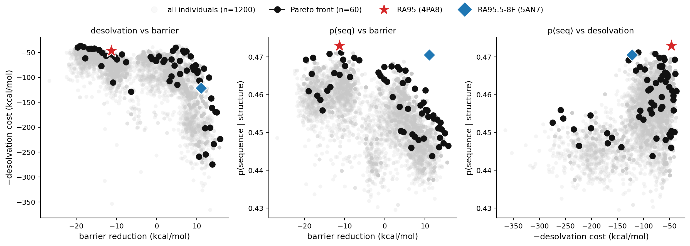

# dEVA with physics-based terms

**Two objectives that come from physics rather than from data.**

The metalloenzyme objective in the dEVA paper needed a curated database of 2,177
zinc sites, of which only 285 were catalytic. Plenty of things worth optimizing
have no such database behind them. This example demos two objectives that don't
need one: a Coulomb sum closed with a QM-derived expansion, and a textbook Born
term. Both plug into dEVA as ordinary objectives. 

NOTE: Neither objectives modeled here are benchmarked or validated experimentally, so treat the numbers as a protoype computaitonal example demonstrating what potential physics-based terms could enable. However, we do our best to walk
through the logic of what is presented her.

---

## Why this enzyme

[Hunt et al.](https://doi.org/10.1021/jacs.5c05134) (*JACS* 2025, 147, 30723) builds on the de novo retro-aldolase RA95. 
In their work, they took the final evolved variant, RA95.5-8F,
and split its 22 mutations into two proteins: **RA95-Core** which keeps only the 12
active-site mutations, and **RA95-Shell** which keeps only the 10 distal ones.

Things to know about what they learned: 

**The active site is not the whole story.** RA95-Core and RA95.5-8F have
*identical* active-site residues, and RA95.5-8F is still 14-fold faster in
k<sub>cat</sub>. Whatever the extra 10 distal mutations are doing, they are
doing it without touching a catalytic residue. Design methods that score only
the first shell are, by construction, blind to it.

**Catalysis depended on the electrostatics and its direction.** The
field magnitude at the catalytic center was comparable across every variant and
conformational state the authors looked at. The *orientation* was not. Point the
field along the charge separation of the C–C cleavage transition state and the
barrier drops; point it elsewhere and it doesn't. Their Field-dependent energy 
barrier (FDB) analysis puts the gap between RA95-Core and RA95.5-8F at 1.5–5 kcal/mol 
from orientation alone. The quantity optimized for is a projection.

**Evolution did not get there by stacking charge.** The distal mutations
introduce a net surface charge change of −4 — three arginines replaced with
neutral residues, plus one new aspartate. 

---

## The three objectives

- **p(seq)** — how likely the sequence is, given the backbone *(LigandMPNN)*
- **electric field** — how much the protein's field lowers the barrier for the
  chemical step *(Coulomb sum + FDB expansion)*
- **desolvation** — the energetic price of burying charged residues *(Born)*

For more information on how each of these objectives are formulated, check the end of this file.

## The run

Scaffold **4PA8**: the de novo retro-aldolase catalyzing C–C bond cleavage.
Three objectives, 60 generations, 60 individuals, catalytic residues held fixed.

```bash
python run.py --config configs/retroaldolase_ef.yml \
              --models seq_model electric_field desolvation
```

---

## The result



- **gray** — all designs
- **black** — the Pareto front
- **red star** — RA95, the starting scaffold
- **blue diamond** — RA95.5-8F, what 19 rounds of directed evolution produced

| | p(seq) | barrier reduction | −desolvation |
|---|:---:|:---:|:---:|
| **RA95** (4PA8) | 0.473 | −11.26 | −46.4 |
| **RA95.5-8F** (5AN7) | 0.471 | +11.12 | −121.5 |

The starting scaffold has a field that *opposes* the reaction. Via directed
evolution flipped, the electric field was flipped. With this insight, dEVA finds designs that flip it too: gains in 
field are paid for in buried charge.

---

## The two physics-based terms

### electric field

The field at a probe point in the active site is the Coulomb sum over every
partial charge in the protein (Hunt et al. eq 6). The barrier responds to it
through the field-dependent expansion (their eq 7):

```
dE‡(F) = dE‡(0) − dMu·F − ½ F·dAlpha·F − ⅙ dBeta F³
```

where dMu, dAlpha and dBeta are reactant → TS differences from QM on the
theozyme. Fitness is the **barrier reduction** in kcal/mol, so **higher is
better**. Given the two QM structures, it locates the breaking bond, puts
the probe at its midpoint, takes the axis along it, and superposes the whole
thing onto the scaffold. Nothing to paste in by hand. Catalytic residues that
live inside the QM model are excluded from the Coulomb sum, as in the paper.

### desolvation

Optimizing −dMu·F alone is unbounded. The cheapest way to strengthen a field at
a fixed point is to park formal charges near it, which is free in a fixed-charge
Coulomb sum and ruinous in a real protein. Directed evolution went the other though, 
suggesting that the field needs a counterweight that accounts for desolvation.

Moving a charge from water into a low-dielectric interior costs Born energy:

```
dG = (q²/2R)(1/eps_p − 1/eps_w)
```

At q = 1 e, R = 2.5 Å, eps_p = 4, eps_w = 80 that's ~15 kcal/mol for a fully
buried uncompensated charge, or in other words the literature range. The prefactor is anchored in
theory; if you want to change it, change the dielectric or the Born radius. Salt bridges are credited, so the penalty tracks the
*local net* charge rather than each charge separately. Fitness is the negative
total cost, in kcal/mol, so higher is better and it sits on the same energy
scale as the field term.

Because, they are meant to pull against each other, an ideal solution optimizes them jointly. A
weighted sum would bury the trade-off in a constant.

## Files

| file | what it is |
|---|---|
| `electric_field.py` | the field objective |
| `desolvation.py` | the buried-charge penalty |
| `theozyme_axis.py` | derive the reaction axis from QM structures |
---

