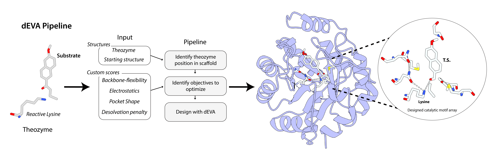

# Using dEVA for theozyme-based design

**You do not need a training set to add an objective to dEVA.** If you can
compute a number from a structure, you can optimize it.

This example starts from the theozyme computed in for the de novo retro-aldolase **RA95** in ([Hunt et al., *JACS* 2025](https://doi.org/10.1021/jacs.5c05134)).

Hunt et al. made variants of the evolved RA95.5-8F and experimentally measured their kinetics. The active ones were geometrically preorganized, but more importantly their electric field pointed along the charge separation of the C–C cleavage transition state.

We turn that idea into ordinary dEVA scores. No curated dataset needed! In this example, we generate two physics based terms, one geometric term, and and a sequence term to optimize the theozyme in a barrel scaffold.

> These physics terms are prototype approximations! They may not be the best way to capture the physics of the theozyme.

---

## What we optimize

Higher is better for every score.

| score | plain English |
|---|---|
| **p(seq)** | Does this sequence look like it belongs on this backbone? *(LigandMPNN)* |
| **electric field** | Does the protein’s field point the right way, so it should *lower* the reaction barrier? *(Coulomb sum + QM dipole)* |
| **pocket shape** | Does the pocket still fit the ligand pose? *(geometry)* |
| **desolvation** | Did we bury a pile of unpaired charges to fake a strong field? *(Born)* |

`relax` is **optional** and is **not** a score. If you include it, keep it second in `--models`. Leave it out for a fixed backbone design. For more information on how the active site was positioned, see demo [`example_theozyme_placement.md`](example_theozyme_placement.md).

Catalytic residues **A231** and **A108** stay fixed. For more information on how the active site was positioned, see demo [`example_theozyme_placement.md`](example_theozyme_placement.md).

---

## How to run it

Scaffold: `inputs/ra95/ra95_barrel_rank1.pdb`. 60 generations, 30
individuals, 3 mutations per child. Full settings:
[`configs/ra95/ra95_barrel_rank1.yml`](../configs/ra95/ra95_barrel_rank1.yml).

```bash
python run.py -c configs/ra95_example.yml \
  --models seq_model relax electric_field pocket_shape desolvation
```

---

## The process



Three steps.

1. **Place the theozyme.** The QM reactant / TS pair (substrate + reactive lysine) is seated in a starting structure. That is a separate demo: [`example_theozyme_placement.md`](example_theozyme_placement.md). This example picks up after that, at `inputs/ra95/ra95_barrel_rank1.pdb`.
2. **Pick the scores.** Anything that returns a number works as a score. Here we use    sequence likelihood, electric field, pocket shape, and a desolvation penalty. `relax` is optional and sits between design and scoring so those terms see a flexible backbone.
3. **Design with dEVA.** Mutate, relax, score, keep the non-dominated set. 

The output is a designed catalytic motif in the barrel: lysine + transition state still posed, sequence and pocket allowed to change around them. The theozyme geometry remains fixed during design.

---

## Simple explanations of the physics terms

### Electric field

1. Put a probe at the midpoint of the breaking C–C bond (taken from the
   QM reactant / TS pair in the config).
2. Add up the Coulomb field from every partial charge in the protein.
   Catalytic residues already in the QM model are left out, as in Hunt et
   al.
3. Project that field onto the reaction axis. Fitness is the estimated
   **barrier reduction** in kcal/mol.

If the field points with the charge movement, the barrier drops and the score goes up. If it points the other way, the score is negative.

### Desolvation

A Coulomb sum will reward parking formal charges next to the probe. That is free in the field term and expensive in a real protein.

The counterweight is a Born cost for burying unpaired charge:

```
dG = (q² / 2R) (1/eps_p − 1/eps_w)
```

The penalty tracks *local net* charge, not every ion separately. Fitness is **negative** that cost, so it sits on the same kcal/mol scale as the field term.

---

## Files

| file | role |
|---|---|
| [`configs/ra95_example_.yml`](../configs/ra95_example_.yml) | this example’s run |
| [`models/relax.py`](../models/relax.py) | backbone relax (not a score) |
| [`models/electric_field.py`](../models/electric_field.py) | field / barrier-reduction score |
| [`models/desolvation.py`](../models/desolvation.py) | buried-charge penalty |
| [`models/pocket_shape.py`](../models/pocket_shape.py) | ligand-pocket geometry |
| [`models/theozyme_axis.py`](../models/theozyme_axis.py) | reaction axis from the QM pair |
