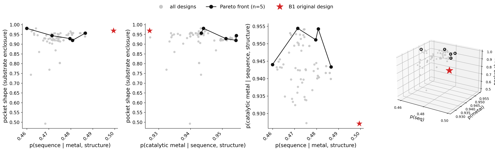

# dEVA with a theozyme

**Adding a substrate-aware objective to dEVA.**

dEVA is not limited to metal-coordination objectives. Here we add a third,
substrate-aware objective and show that the designs organize into a Pareto
front — trading substrate enclosure against sequence likelihood and
catalytic-metal probability. We provide this as a simple example of optimization of a traditionally generated enzyme design.

---

## The three objectives

- **p(seq)** — how likely the sequence is, given the backbone and ligand *(LigandMPNN)*
- **p(catalytic metal)** — probability of a catalytic metal at the site *(Metal3D-Cat)*
- **pocket shape** — how well the pocket encloses a fixed substrate pose *(geometric term)*

The first two are the objectives from the paper. The third represents a
**geometric** score that is provided alongside the other dEVA objectives (`../models/pocket_shape.py`).

---

## The run

Here we use one of the less-active enzyme designs [Kim et al.](https://www.nature.com/articles/s41586-025-09746-w) from design campaign 1 **B1**: a metalloenzyme with a buried active site and a bound substrate analog. 

Here we run dEVA using three objectives, 5 individuals, 10 generations, where we fix the catalytic metal residues. To find the full yaml file, please check `../configs/substrate_example.yml`.

```bash
python run.py --config configs/substrate_example.yml \
              --models seq_model metal3d_model pocket_shape
```

---

## The result

The Pareto front represents a real trade-off: front designs raise metal probability while
giving up a little sequence likelihood and pocket enclosure, and one improves
pocket shape past the input. This is what a multi-objective optimizer should
do — satisfy the objectives jointly and make the trade-offs explicit.



**Original B1:** p(seq) 0.499 · p(metal) 0.927 · pocket 0.969

**Pareto front (n = 5):**

| p(seq) | p(cat metal) | pocket |
|:---:|:---:|:---:|
| 0.481 | 0.954 | 0.920 |
| 0.480 | 0.951 | 0.929 |
| 0.471 | 0.954 | 0.944 |
| 0.487 | 0.943 | 0.957 |
| 0.460 | 0.944 | 0.981 |

**[`substrate_interactive.html`](https://htmlpreview.github.io/?https://github.com/gelnesr/dEVA/blob/main/examples/html/substrate_interactive.html)** — the same plot, rotatable (drag / scroll).

