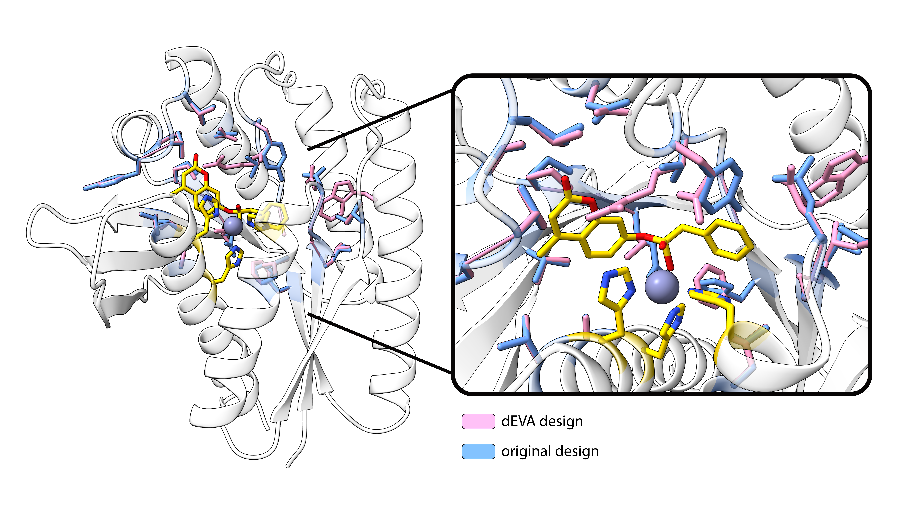

# Using dEVA with a substrate-aware score

**Adding a substrate-aware objective to dEVA during metalloenzyme design.**

This example starts from a designed metalloenzyme with a buried active site and a bound substrate analog (`inputs/B1.pdb`). The metal site is already there. What we add is a **geometric** score that scores the occlusion of the ligand by the protein heavy atoms.

The first two scores are the sequence and catalytic-metal terms described in the manuscript. The third is an additional score called pocket shape to allow dEVA to trade-off enclosure against likelihood and metal probability instead of burying that trade-off in a weight.

> Pocket shape is a prototype geometric filter, not a binding free
> energy. Calibrate `target_occ` on structures you trust.



---

## What we optimize

| score | desired property|
|--------|----------------|
| **p(seq)** | Does this sequence look like it belongs on this backbone and ligand? *(LigandMPNN)* |
| **p(catalytic metal)** | Is there still a catalytic metal at the site? *(Metal3D-Cat)* |
| **pocket shape** | Does the pocket enclose the fixed ligand pose, without clashing or sealing it? *(geometry)* |

---

## How to run it

Starting structure: `inputs/B1.pdb`. 10 generations, 5 individuals,
1 mutation per child. Full settings:
[`configs/substrate_example.yml`](../configs/substrate_example.yml).

```bash
python run.py -c configs/substrate_example.yml \
  --models seq_model metal3d_model pocket_shape
```

---

## The process

Three steps, same shape as the physics example.

1. **Start from a posed site.** The metal ligands and the substrate analog are already in the PDB. Ligand-only coordinates live in `inputs/B1_ligand.pdb` (same frame as the complex).
2. **Pick the scores.** Anything that returns a number works as a score. Here we use: sequence likelihood, catalytic-metal probability, and pocket shape.
3. **Design with dEVA.** Mutate, score, keep the non-dominated set.

Pink is a dEVA design, blue is the starting structure. The metal site and substrate pose stay put; the pocket side chains around them move.

---

## Simple explanation of pocket shape

The ligand pose is fixed. The score asks how many protein heavy atoms sit near each ligand atom (**occlusion**), then subtracts clashes. The score is then normalized to be between 0 and 1.

```
fitness = window(occlusion) − w_clash × overlap
```

`target_occ` is the occlusion you want (here 105, taken from the
starting complex). The window is not “more burial is better”: packing
the site completely would block solvent, so overshooting the target
is penalized. Higher is better; 1.0 means occlusion hit the target
and there is no clash.

---

## Files

| file | role |
|---|---|
| [`configs/substrate_example.yml`](../configs/substrate_example.yml) | this example’s run |
| [`models/pocket_shape.py`](../models/pocket_shape.py) | ligand-pocket geometry |
| [`models/metal3d_model.py`](../models/metal3d_model.py) | catalytic-metal probability |
| `inputs/B1.pdb` | starting complex |
| `inputs/B1_ligand.pdb` | ligand pose (same frame) |
