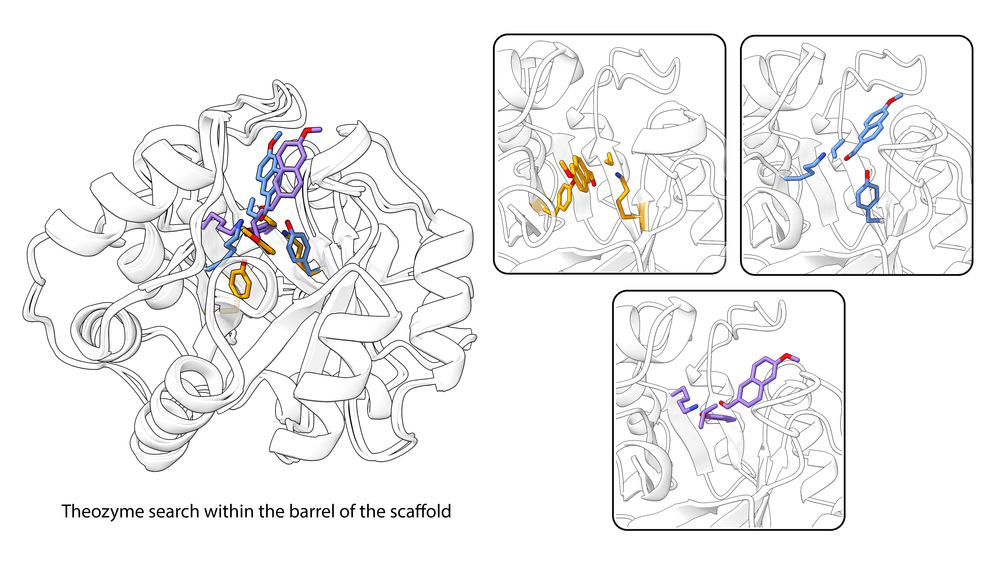

# Placing a theozyme

Here we provide functionality to place a theozyme in a given protein scaffold. That gives dEVA a fixed catalytic geometry to design around.

A theozyme is a small QM snapshot: catalytic side chains plus substrate or transition state. Placement does not change that geometry. It only looks to find *where on a given scaffold  those atoms sit*. Here we provide functionality to place any number of atoms as theozyme anchors during placement.



---

## How it works

You need three things:

| input | role |
|---|---|
| **X,Y,Z** | the QM atoms in one frame |
| **theozyme JSON** | which of those atoms are residues vs ligand |
| **scaffold PDB** | the protein you graft onto |

The JSON names roles. Atom indices are **1-based** into the XYZ.

- **anchor** — the residue used to guide the theozyme search into the scaffold.
  χ1/χ2 about CB swings the rigid QM geometry onto the scaffold.
  Required. Declare at least `CB`.
- **other catalytic residues** — anything else that has to come along
  (a second side chain, a H-bond donor, …). Optional; zero or many.
  The JSON role is `"satellite"` — that just means “not the frame.”
  Placement matches each one by CB onto a nearby residue on the
  scaffold (a **host**). You choose which residues are allowed.
- **ligand** — the substrate / TS atoms, written out as residue **901**.

Two chemistries, one CLI:

- **Covalent** — set `covalent_to_ligand` on the anchor (tip atom +
  ligand atom). The output PDB gets a LINK record.
- **Non-covalent** — omit that field. The anchor is only the frame;
  catalysis is tip⋯ligand distances, not a bond.

```json
{
  "name": "my_theozyme",
  "xyz": "path/to/Transition_State.xyz",
  "residues": [
    {
      "role": "anchor",
      "resn": "SER",
      "atoms": { "CB": 1, "OG": 2 }
    },
    {
      "role": "satellite",
      "resn": "HIS",
      "atoms": { "CB": 10, "CG": 11, "ND1": 12, "NE2": 15 }
    }
  ],
  "ligand": {
    "resn": "LIG",
    "atoms": { "C1": 20, "O1": 21 },
    "bonds": [["C1", "O1"]],
    "partial_bonds": []
  }
}
```

Point `"xyz"` at your QM file and fill in the real indices. Full JSON rules can be found in [`theozyme/README.md`](../theozyme/README.md).

Sanity-check before searching:

```bash
python -c "from theozyme.spec import TheozymeSpec; print(TheozymeSpec('my_theozyme.json').summary())"
```

### The search

`theozyme/prepare_placements.py` does five things:

1. **Load** the spec and the scaffold.
2. **Explore** every `--anchors` site along a χ1/χ2 grid.
3. **Filter** by how well the other catalytic CBs land, and by pocket
   occlusion.
4. **Build** the best assignments: mutate catalytic residues in, write
   the ligand as resi 901.
5. **Rank** and write PDBs.

GLY/PRO anchors are skipped. The other catalytic side chains need **host** residues — scaffold positions whose CB can accept them. Pass those as `--satellite-positions`. That list is just residue numbers; it is not fold-specific. Leave it off to search more broadly, or add a helper flag later if you have one for your fold.

### Optional: relax

Accomodating a theozyme may require that nearby backbone move. This has been added as an optional feature to accommodate flexible backbone design. We provide this as an otpional method, with two non-exclusiveoptions:

- **During placement.** The build can nudge host loops so a catalytic
  CB lands (`--sat-mode`, default `shift`). Skip that with `--no-accommodate`.
- **During evolution.** The dEVA `relax` model does the same idea
  between generations. Leave it out of `--models` if you want a
  fixed backbone. If you include it, keep it **second** (right after
  `seq_model`) so later scores see the relaxed structure.

These are two switches for the same intent. Neither is required to place a theozyme.

### Generic run

```bash
python theozyme/prepare_placements.py \
  --scaffold path/to/scaffold.pdb \
  --theozyme-spec my_theozyme.json \
  --name my_theozyme \
  --anchors 40-60,80-100 \
  --satellite-positions 45,90,120 \
  --out-dir inputs/my_theozyme \
  --build-max 25
```

You can also start from a theozyme PDB instead of JSON+XYZ (`--theozyme-pdb` + `--catalytic ANCHOR[,SAT...]`).

### Outputs

Under `--out-dir` (default `inputs/<name>/`):

| file | what it is |
|---|---|
| `{name}_rank{i}.pdb` | protein + ligand (resi 901) |
| `{name}_rank{i}_ligand.pdb` | ligand only |
| `{name}_candidates.json` | every graft that passed explore |
| `{name}_report.json` | built ranks, catalytic residues, occlusion |

Point a dEVA config at a ranked PDB and evolve. `relax` in that campaign is optional (see above).

---

## Example: RA95 in a barrel

RA95 is a covalent retro-aldolase: a lysine forms a Schiff base to the substrate, and a tyrosine helps ([Hunt et al., *JACS* 2025](https://doi.org/10.1021/jacs.5c05134)). The QM pair is already solved. Placement just finds barrel sites that can host it.

The spec is the generic JSON above: Lys is the anchor, Tyr is the other catalytic residue (`"satellite"` in the JSON):

```json
{
  "role": "anchor",
  "resn": "LYS",
  "atoms": { "CB": 1, "CG": 2, "CD": 3, "CE": 4, "NZ": 5 },
  "covalent_to_ligand": {
    "atom": "NZ",
    "ligand_atom": "C13",
    "order": "double"
  }
}
```

```bash
python theozyme/prepare_placements.py \
  --scaffold path/to/barrel.pdb \
  --theozyme-spec project_retroaldolase/theozyme_RA95_spec.json \
  --name ra95_barrel \
  --anchors 40-240 \
  --satellite-positions 51,83,108,110,157,159,210,231 \
  --out-dir inputs/ra95 \
  --build-max 25
```

Those hosts are pocket-facing positions on this barrel. On another fold you would list different residues. (`--barrel-shell` is an optional shortcut that infers β-strand hosts for TIM barrels only.)

The physics example starts from **rank 1**
(`inputs/ra95/ra95_barrel_rank1.pdb`):

- catalytic pair **A231** (Lys, the frame) and **A108** (Tyr)
- Lys NZ covalently on ligand C13
- Tyr OH still at the QM hydrogen-bond to O11
- ligand occlusion 105.0 (later `pocket_shape.target_occ`)

Those two residues stay fixed in
[`configs/ra95_example.yml`](../configs/ra95_example.yml) while all other residues are free to evolve and mutate. This campaign turns evolution-time `relax` on so field / pocket / desolvation work via flexible-backbone design; you can drop it for a fixed-backbone run.

Next: [`example_physics.md`](example_physics.md).

```bash
python run.py -c configs/ra95_example.yml \
  --models seq_model relax electric_field pocket_shape desolvation
```
